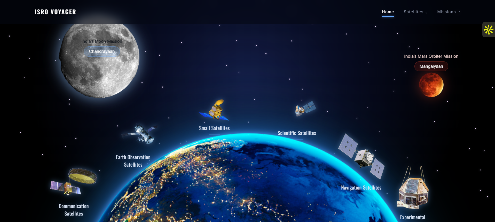
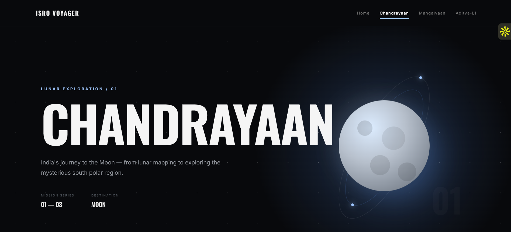
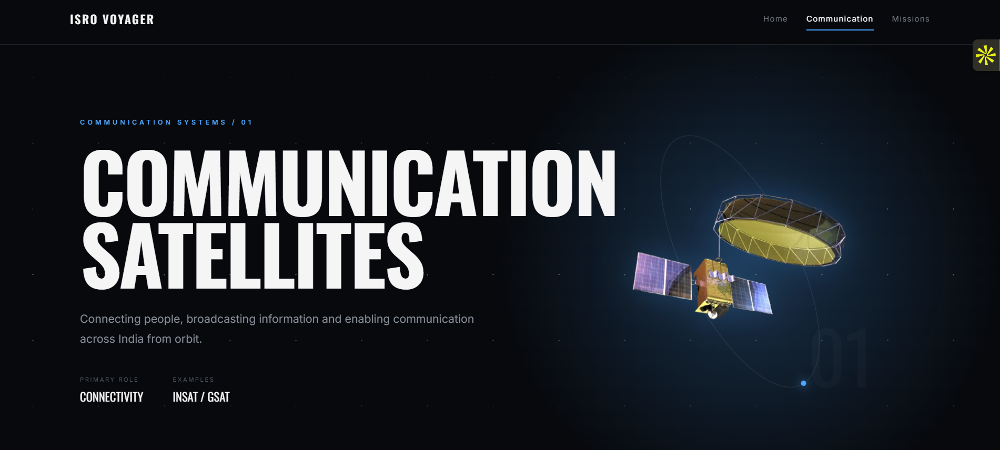

# 🌌 ISRO VOYAGER  
_A cinematic, interactive space experience inspired by ISRO missions._
> **Discover India’s achievements beyond Earth**


## 🔭 Project Description

**ISRO Voyager** is an interactive, cinematic space-themed website that visualizes India’s major space missions and satellite programs.  
It features a floating planet UI, glowing satellites, multi-page mission timelines, category pages, and a dark nebula-inspired interface — built entirely using **HTML**, **CSS**, and **vanilla JavaScript**.

The project is designed as both an **educational resource** and a **portfolio-quality web experience** showcasing ISRO’s achievements beyond Earth.

## 🚀 Live Demo

### ▲ Vercel Deployment  
https://isro-voyager.vercel.app/

## 📸 Screenshots

### 🏠 Homepage  


### 🌕 Chandrayaan  


### 🛰 Satellite Categories  


## 🎖️ Badges

<p align="center">

  <!-- Tech Stack -->
  
  
  

  <!-- Repo Stats -->
  
  
  
  

  <!-- Project Status -->
  


</p>

## 📁 Folder Structure
```
isro-voyager/
│
├── index.html
├── style.css
├── script.js
│
├── assets/
│   ├── earth.png
│   ├── moon.png
│   ├── mars.png
│   ├── rocket.png
│   ├── sat-comm.png
│   ├── sat-earthobs.png
│   ├── sat-science.png
│   ├── sat-nav.png
│   ├── sat-experimental.png
│   └── sat-small.png
│
├── missions/
│   ├── chandrayaan.html
│   ├── mangalyaan.html
│   └── aditya.html
│
└── categories/
    ├── communication.html
    ├── earth-observation.html
    ├── navigation.html
    ├── scientific.html
    ├── experimental.html
    └── small-satellites.html


```
## 🛠 Setup Instructions

### 1️⃣ Clone the repository

git clone https://github.com/Yashada18/isro-voyager.git

2️⃣ Navigate into the folder
cd isro-voyager

3️⃣ Open in your browser

Either double-click index.html
OR use VS Code Live Server:

# VS Code
Right-click → "Open with Live Server"

4️⃣ Done!

The entire site runs directly in the browser — no backend required.


## 🤝 Contributing

Pull requests are welcome!  
Feel free to add new missions, animations, UI improvements, or features.

## ⭐ Support

If you like this project, please **star⭐ the repository** — it really helps!

## 👨‍🚀 Author

**Yashada**  
🔗 GitHub: https://github.com/Yashada18


